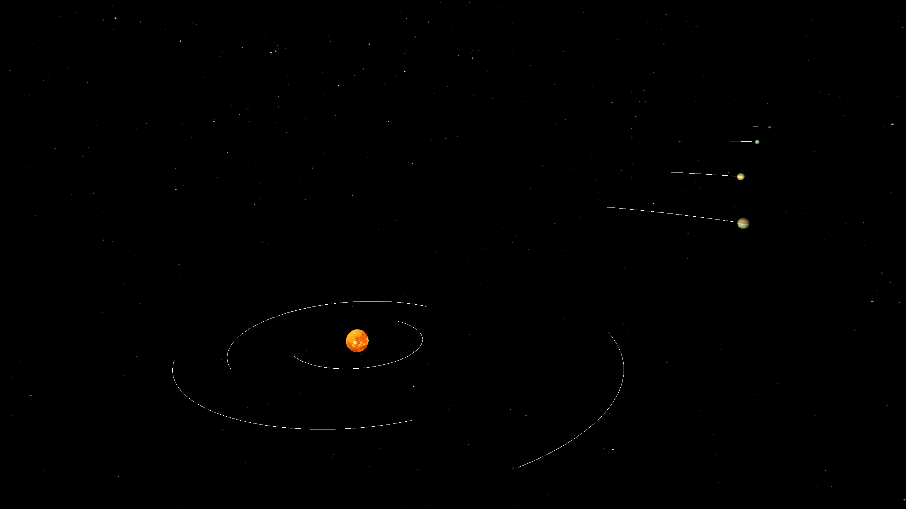
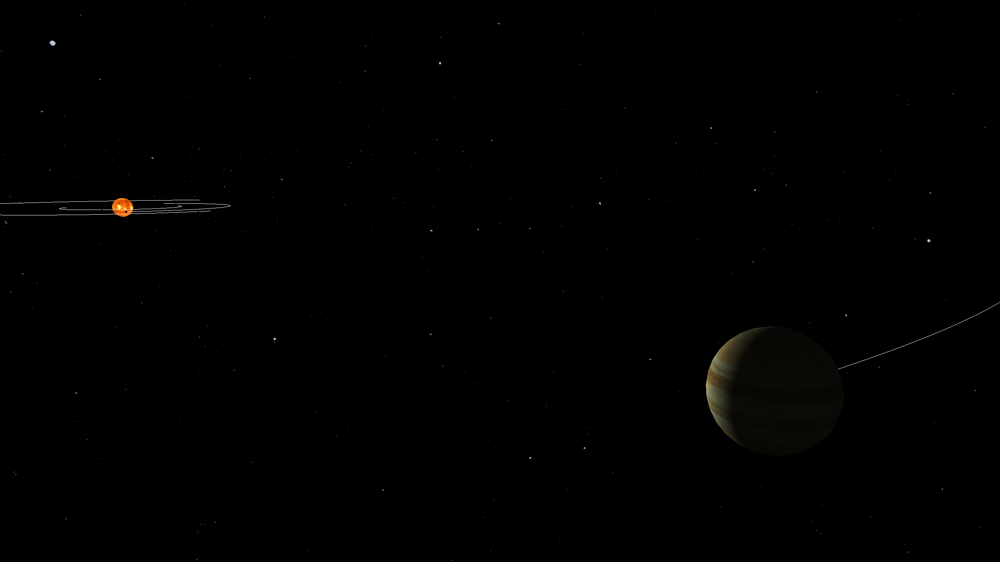

# Planetary Simulation


A real-time 3D planetary simulation engine built with C++ and OpenGL. The project combines a simple N-body gravity system with textured planet rendering, orbital trails, a skybox, and free-camera exploration.

## Screenshots and GIFs

Photos are taken from the default `solar_system.txt` preset, which aims to mimic our own solar system. 
Distances are scaled down by 1e10, masses are scaled to units of Earth masses. G is set to 0.00174 and orbital velocities are computed upon these values.
For better visibility, the radius of the sun and planets are scaled up (non uniformly).


*Full solar system view with lighting, a skybox, and orbital trails.*


*Close-up of a planetary body, showcasing textures and dynamic lighting from the sun.*

## What This Project Does

- Simulates gravitational attraction between celestial bodies in real time.
- Renders planets and the sun as 3D textured spheres.
- Draws orbital trails so motion is easier to read over time.
- Uses a skybox and dynamic lighting to give the scene more depth.
- Loads planetary systems from preset text files instead of hardcoding them.

## Features

- **N-body gravity simulation** using pairwise force updates between bodies.
- **Fixed-timestep physics loop** for more stable simulation updates.
- **3D OpenGL rendering** with custom shaders for planets, trails, the sun, and the skybox.
- **Wavefront OBJ model loading** for sphere geometry.
- **Textured celestial bodies** loaded through a central resource manager.
- **Orbital trail rendering** backed by dynamic OpenGL buffer updates.
- **Free camera controls** for navigating the scene in first-person.
- **Preset-driven world building** through editable files in `presets/`.
- **16:9 letterboxed viewport** to keep presentation consistent when resizing.

## Tech Stack

- C++17
- OpenGL 3.3 Core Profile
- GLFW
- GLAD
- GLM
- FreeType (for text rendering, not implemented yet)
- stb_image
- CMake

## Project Structure

- `src/` - engine, physics, rendering, resources, and object creation.
- `include/` - shared headers and core types.
- `shaders/` - GLSL shader programs for scene rendering.
- `textures/` - planet, sun, and skybox textures.
- `models/` - mesh assets used for rendering spheres and other geometry.
- `presets/` - text-based simulation setups such as `solar_system.txt`.

## Dependencies

Make sure these are available before building:

- `CMake` 3.10+
- `OpenGL` 3.3+
- `GLFW` 3.3
- `FreeType`
- `GLAD` included in `include/glad`
- `GLM` installed system-wide or otherwise available to the compiler
- `stb_image` included in `include/stb_image.h`

## Build Instructions

```bash
git clone <repository-url>
cd Planetary-Simulation
mkdir build
cd build
cmake ..
make
```

## Running the Simulation

You can run the executable from any directory. For example, from the project root:

```bash
./build/PlanetarySystem
```

## Controls

- `W`, `A`, `S`, `D` - move the camera
- Mouse - look around
- `Left Ctrl` - release or lock the cursor
- `Esc` - quit the application

## Configuration

The default simulation is loaded from `presets/solar_system.txt`. You can create new systems by editing that file or adding another preset with the same format.

### Preset Format

```text
constants
G <gravitational_constant>

<sun>
pos <x> <y> <z>
radius <radius>
mass <mass>
vel <vx> <vy> <vz>
color <r> <g> <b>

<planet_name>
pos <x> <y> <z>
radius <radius>
mass <mass>
vel <vx> <vy> <vz>
color <r> <g> <b>
```

- `sun` - reserved identifier for the system's light-emitting star
- `pos` - starting position
- `radius` - rendered object size
- `mass` - value used in gravitational calculations
- `vel` - starting velocity
- `color` - base tint passed into rendering

If a planet name does not match a loaded texture, the engine falls back to a default plain texture.

## Learning Points

This project has been a good hands-on exercise for learning:

- how a basic game or simulation loop separates input, update, and render stages
- how fixed timesteps improve consistency in real-time physics
- how Newton-style gravity can be approximated in an interactive N-body simulation
- how to organize rendering, physics, and world state into separate systems
- how OpenGL resources such as shaders, textures, VAOs, and VBOs are loaded and managed
- how dynamic vertex buffer updates can be used to draw orbital trails
- how camera movement and mouse look work in a 3D environment
- how external data files can drive scene creation without recompiling the project
- how CMake ties together source files and third-party graphics dependencies

## Possible Extensions

- add UI controls for pausing, resetting, or changing simulation speed
- support selecting different preset files at launch
- add collision handling or body merging
- improve the physics integrator for better long-term orbital stability
- add labels, overlays, or body-specific information panels

## Notes

- The simulation is designed as a learning project and can be extended into a more advanced engine or sandbox.
